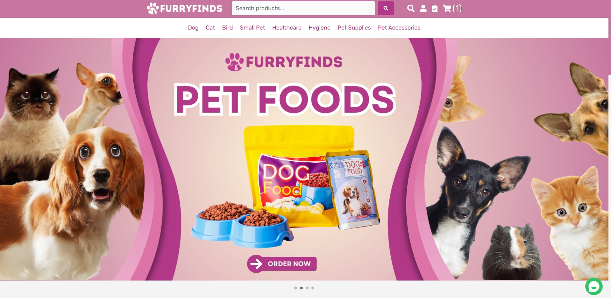
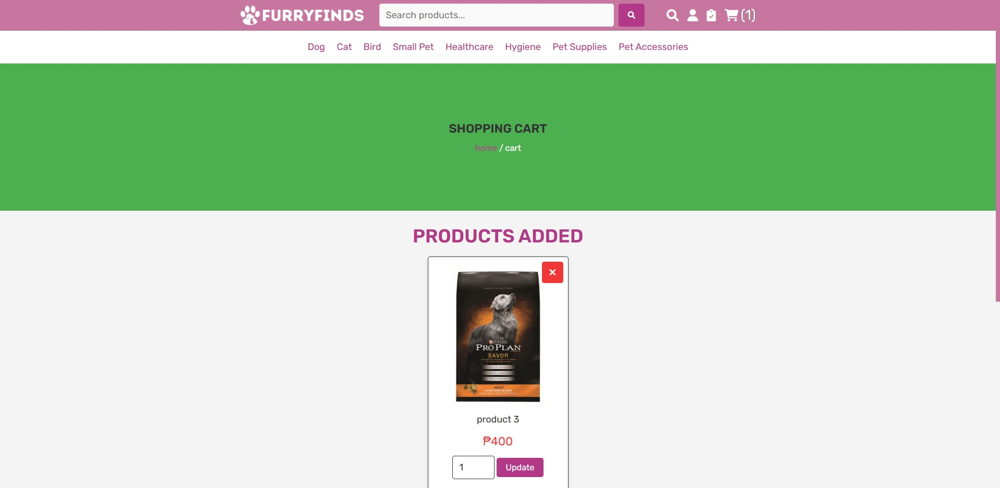
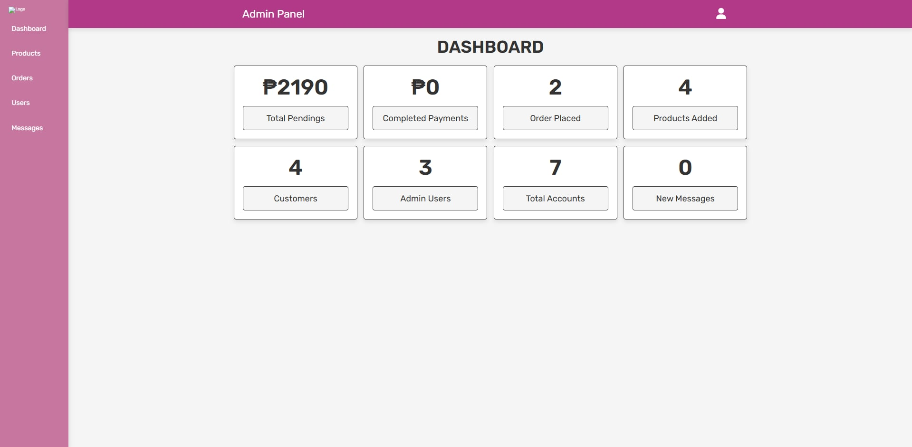
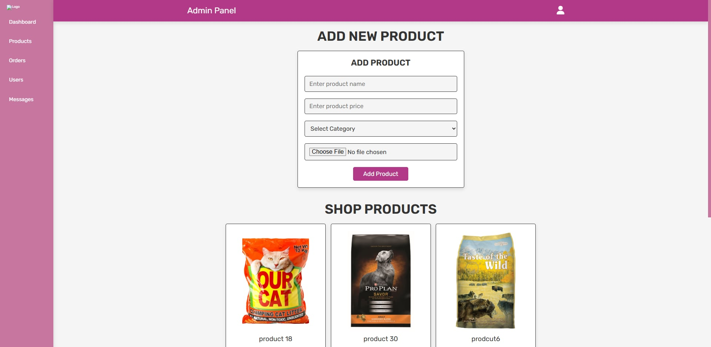
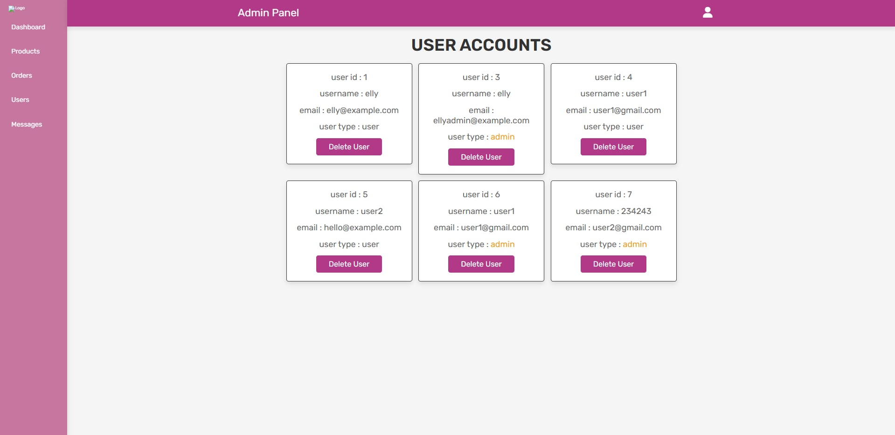
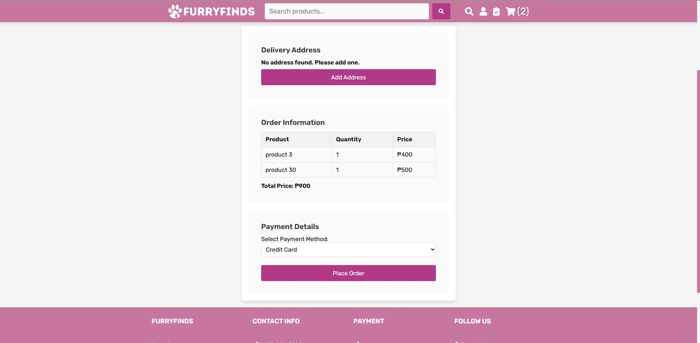
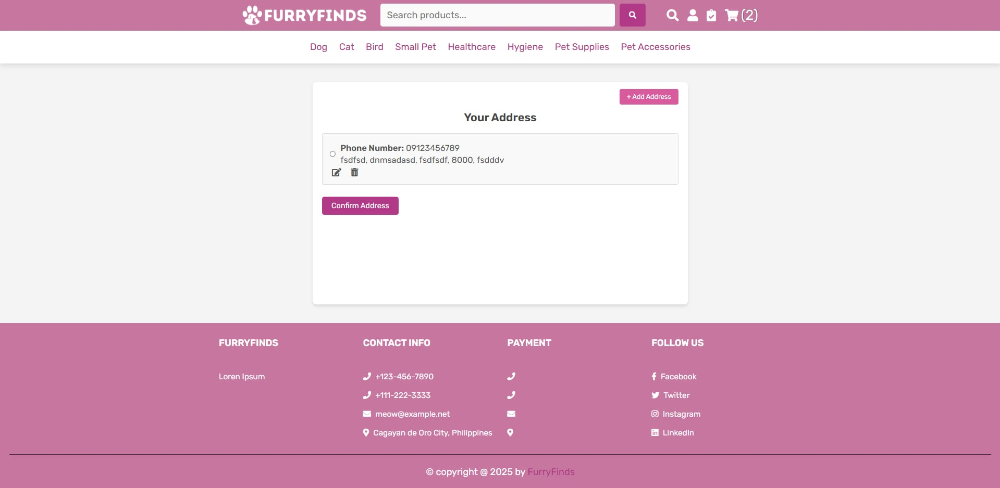
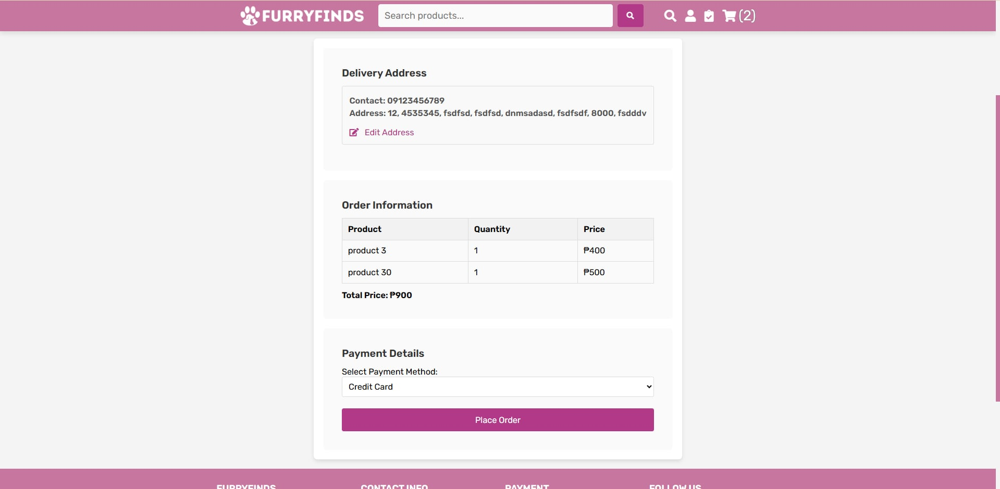

# 🐾 FurryFinds – E-Commerce Website for Pet Food and Supplies

**FurryFinds** is a PHP-based e-commerce platform for selling **pet food**, **accessories**, and **supplies**.  
This system allows customers to browse products, add them to the cart, and place orders while admins manage the inventory, users, and orders.

---

## 🛒 Features

✅ **User Side**
- Browse products by category (Dogs, Cats, Fish, Birds, etc.)
- Search and filter products
- Add to cart and checkout
- Create an account and log in
- View order history

✅ **Admin Side**
- Admin login dashboard
- Add/edit/delete products
- Manage categories and inventory
- View and process customer orders
- Track stock levels

✅ **Other Features**
- Responsive UI using HTML/CSS/JS
- Basic validations with JavaScript
- MySQL database for storage
- Order status updates (Pending, Shipped, Delivered)

---

## 🛠️ Technologies Used

| Component      | Technology       |
|----------------|------------------|
| Backend        | PHP              |
| Frontend       | HTML, CSS, JavaScript |
| Database       | MySQL            |
| Styling        | CSS (Vanilla)|
| Server         | XAMPP|

---
## USER
LOGIN

HOMEPAGE

CART

## ADMIN
DASHBOARD

ADD PRODUCT

USER ACCOUNTS

DELIVERY ADDRESS

